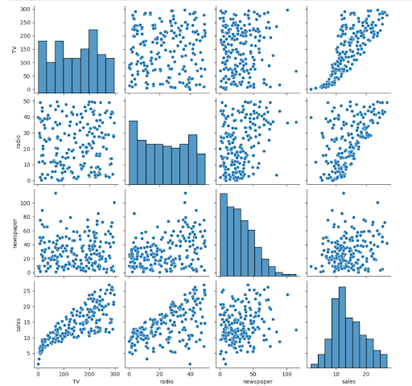
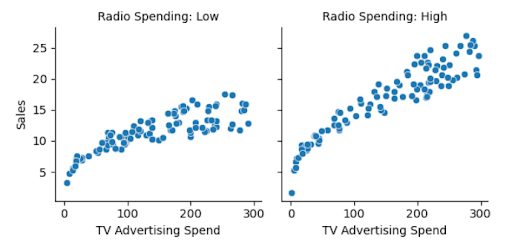

# Data Visualization Project - Advertising Spending vs Sales

This project involves exploring and visualizing a dataset that examines the relationship between advertising spending and sales. The dataset includes variables for TV, radio, and newspaper advertising spend, as well as the sales generated from these efforts. The goal was to apply multivariate data visualization techniques to analyze patterns and support conclusions.

---

## Table of Contents
- [Data Visualization Project - Advertising Spending vs Sales](#data-visualization-project---advertising-spending-vs-sales)
  - [Table of Contents](#table-of-contents)
  - [Features](#features)
  - [Technologies Used](#technologies-used)
  - [Dataset](#dataset)
  - [How It Works](#how-it-works)
  - [Visualizations](#visualizations)
  - [Analysis and Insights](#analysis-and-insights)
  - [Usage Instructions](#usage-instructions)
  - [Acknowledgments](#acknowledgments)

---

## Features
- Loads and processes the advertising dataset.
- Creates various visualizations to explore relationships between advertising spending and sales.
- Applies multivariate data visualization techniques such as scatter plots, pair plots, and tree maps.
- Provides insights on how different advertising channels influence sales.

---

## Technologies Used
- **Python 3.9+**
- **pandas**: For data manipulation and analysis.
- **matplotlib**: For static, interactive, and animated visualizations.
- **seaborn**: For statistical data visualization (used for advanced visualizations like pair plots and faceted grids).
- **squarify**: For creating tree maps to visualize advertising spend distributions.
- **numpy**: For numerical operations and efficient data handling.

---

## Dataset
The dataset used in this project contains the following columns:
- **TV**: Advertising spend on TV (in thousands of dollars).
- **Radio**: Advertising spend on radio (in thousands of dollars).
- **Newspaper**: Advertising spend on newspapers (in thousands of dollars).
- **Sales**: Sales generated (in thousands of units).

The data represents a company's advertising spending across multiple channels and the corresponding sales figures.

---

## How It Works
1. **Data Loading**: The dataset is loaded using `pandas` from a CSV file and previewed to check for any issues.
2. **Exploratory Data Analysis (EDA)**: Basic summary statistics and checks for missing data are performed.
3. **Multivariate Visualizations**: Using `seaborn` and `matplotlib`, several visualizations are created to explore the relationships between advertising spending and sales:
   - **Scatter Plot Matrix**: To examine pairwise relationships between all variables (TV, radio, newspaper, and sales).
   - **Trellis Plot**: To analyze the relationship between TV advertising spending and sales, split by radio spending categories (high vs. low).
   - **Tree Map**: To visualize the total advertising spend across TV, radio, and newspaper channels.

---

## Visualizations
The following visualizations are generated to analyze the dataset:

- **Scatter Plot Matrix**: The `sns.pairplot` function is used to visualize pairwise relationships between all variables (TV, radio, newspaper, and sales).
  
- **Trellis Plot**: A trellis plot created using `sns.FacetGrid`, where radio spending is categorized into high and low spending groups, and the relationship between TV spending and sales is analyzed.
  
- **Tree Map**: A tree map created with `squarify` to represent the total spending in TV, radio, and newspaper advertising channels.
  

---

## Analysis and Insights
- **Correlation Between Spending and Sales**: The visualizations help uncover relationships between advertising spending and sales. For example, TV spending is often strongly correlated with higher sales, whereas the relationship between newspaper spending and sales may be weaker.
- **Advertising Spend Distribution**: The tree map helps visualize the total spending in different advertising channels and provides insight into which channel the company invests most in.
- **Radio Spending Categories**: The trellis plot helps examine how high and low radio spending affects the relationship between TV spending and sales.

---

## Usage Instructions

1. **Install Dependencies**: Make sure the following Python libraries are installed:
   ```bash
   pip install pandas matplotlib seaborn squarify numpy
   ```
2. **Run the Program**: Execute the Python script to load the dataset, generate visualizations, and analyze the results.
3. **Dataset Path**: Make sure to update the file path in the code to point to the location where your CSV file is stored:
    ```python
    data = pd.read_csv(r"C:\path\to\dataset.csv")
    ```
4. **Customization**: Modify the script to visualize different datasets or adjust the types of visualizations generated (e.g., adding more plot types or adjusting visualization parameters).

---

## Acknowledgments
This project was part of a data visualization course, focusing on the application of multivariate data visualization techniques to gain insights from real-world data. The dataset was chosen to explore how advertising spending across different channels impacts sales performance.

